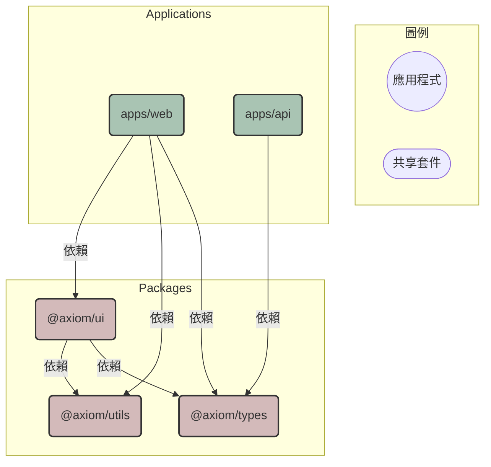

# Axiom

這是一個名為 **Axiom** 的專案骨架，基於 **pnpm workspace** 的 **Monorepo** 架構。它旨在提供一套不證自明的開發公理與最佳實踐，用於快速啟動現代化、可擴展的網頁應用程式。它整合了獨立的前端應用、後端 API、可共享的 UI 元件、工具函式庫和型別定義。

## ✨ 核心目標

- **程式碼共享與重用**：透過 `packages` 目錄，在不同應用之間共享 UI 元件、工具函式和型別定義。
- **開發效率**：利用 Vite 提供快速的開發伺服器和建構流程。
- **程式碼品質**：整合 ESLint, Prettier, TypeScript 和自動化的 Git 鉤子，確保程式碼風格一致且型別安全。
- **結構化與可維護性**：清晰的目錄結構和模組化設計，便於團隊協作和長期維護。

## 🛠️ 技術棧

| 分類            | 技術                                  | 用途                                                     |
| :-------------- | :------------------------------------ | :------------------------------------------------------- |
| **主要框架**    | React 18                              | 建立使���者介面的核心函式庫。                            |
| **建構工具**    | Vite                                  | 提供極速的開發伺服器和優化的生產環境建構。               |
| **語言**        | TypeScript                            | 為專案提供靜態型別檢查，提升程式碼健壯性。               |
| **樣式**        | Tailwind CSS                          | 一個 Utility-First 的 CSS 框架，用於快速設計 UI。        |
| **套件管理**    | pnpm                                  | 高效能的套件管理器，並透過 workspace 功能支援 Monorepo。 |
| **測試**        | Vitest, React Testing Library         | 用於單元測試和元件測試，確保程式碼品質。                 |
| **程式碼規範**  | ESLint, Prettier                      | 強制程式碼風格和語法規範。                               |
| **Commit 規範** | Commitlint, cz-conventional-changelog | 確保 Git 提交訊息的一致性和可讀性。                      |
| **Git 鉤子**    | Husky                                 | 在 Git 事件（如 commit, push）觸發時自動執行腳本。       |

## 📂 專案結構

```
.
├── apps/
│   ├── api/             # 後端 API 應用程式 (Node.js)
│   └── web/             # 前端網頁應用程式 (React)
├── packages/
│   ├── types/           # 共享的 TypeScript 型別定義
│   ├── ui/              # 可重用的 UI 元件
│   └── utils/           # 通用工具函式
├── .husky/              # Git 鉤子設定
├── scripts/             # 自動化腳本
├── .commitlintrc.js     # Commitlint 設定
├── eslint.config.js     # ESLint 設定
├── prettier.config.js   # Prettier 設定
├── tailwind.config.js   # 根 Tailwind CSS 設定
└── tsconfig.json        # 根 TypeScript 設定
```

## 🏗️ 架構與依賴關係

本專案採用 Monorepo 架構，將前後端應用程式 (`apps`) 和共享程式碼 (`packages`) 整合在同一個儲存庫中。

### 依賴關係圖



- **`apps/web`**: 前端應用，依賴 `ui`（元件）、`utils`（工具）和 `types`（型別）。
- **`apps/api`**: 後端 API，依賴 `types`（型別）以確保與前端的資料結構一致。
- **`packages/ui`**: 共享元件庫，依賴 `utils` 和 `types`。
- **`packages/utils`** 和 **`packages/types`**: 基礎套件，無內部依賴。

## 🚀 開始使用

### 先決條件

- [Node.js](https://nodejs.org/) (建議 LTS 版本)
- [pnpm](https://pnpm.io/installation)

### 安裝

1.  **複製儲存庫：**

    ```bash
    git clone <your-repository-url>
    cd axiom
    ```

2.  **安裝依賴項：**
    ```bash
    pnpm install
    ```

### 開發

同時啟動前端和後端開發伺服器：

```bash
pnpm dev
```

- 前端 (`web`) 將運行在 `http://localhost:5173`。
- 後端 (`api`) 將運行在 `http://localhost:3000`。

## 📜 可用腳本

| 指令              | 描述                                   |
| :---------------- | :------------------------------------- |
| `pnpm dev`        | 同時啟動所有 `apps` 的開發伺服器。     |
| `pnpm build`      | 建構所有套件和應用程式以供生產。       |
| `pnpm test`       | 執行所有測試。                         |
| `pnpm test:watch` | 以監聽模式執行測試。                   |
| `pnpm lint`       | 檢查整個專案的程式碼風格。             |
| `pnpm format`     | 自動格式化所有檔案。                   |
| `pnpm type-check` | 執行 TypeScript 的型別檢查。           |
| `pnpm clean`      | 清理所有 `dist` 目錄。                 |
| `pnpm commit`     | 使用 Commitizen 引導式地產生提交訊息。 |

## 🤝 貢獻

我們非常歡迎所有形式的貢獻！如果您希望為 Axiom 專案做出貢獻，請遵循以下步驟：

### 開發流程

1.  **Fork 本儲存庫** 到您自己的 GitHub 帳戶。
2.  從 `develop` 分支建立一個新的功能分支。請遵循以下命名慣例：
    - 新功能: `feat/a-brief-description` (例如: `feat/user-password-reset`)
    - 錯誤修復: `fix/a-brief-description` (例如: `fix/login-form-validation`)
3.  進行您的程式碼變更。
4.  在提交之前，請確保所有品質檢查都已通過：
    - 執行測試: `pnpm test`
    - 檢查程式碼風格: `pnpm lint`
5.  **提交您的變更**。本專案嚴格遵守 Conventional Commits 規範。我們強烈建議使用 `pnpm commit` 指令，它會引導您產生合規的提交訊息。
6.  將您的功能分支推送到您 Fork 的儲存庫。
7.  建立一個 Pull Request，目標分支為原始儲存庫的 `develop` 分支。請在 PR 的描述中詳細說明您的變更內容。

## 🔮 後續發展建議

- **元件庫文件**: 為 `packages/ui` 增加 Storybook 或類似工具，以建立元件文件和互動式展示。
- **狀態管理**: 根據應用複雜度，考慮引入 Zustand, Redux Toolkit 或其他狀態管理方案。
- **CI/CD**: 建立自動化的持續整合與部署流程 (例如使用 GitHub Actions)，在程式碼推送到主分支時自動執行測試、建構和部署。

## 📚 專案文件

本專案的核心文件存放於 `docs/` 目錄下：

- **產品需求文件 (PRD)**: 定義專案的願景、目標和功能需求。
- **架構決策紀錄 (ADRs)**: 記錄重要的技術選擇及其背後的理由。
- **開發待辦清單 (TODO)**: 追蹤專案的開發進度和未來規劃。
