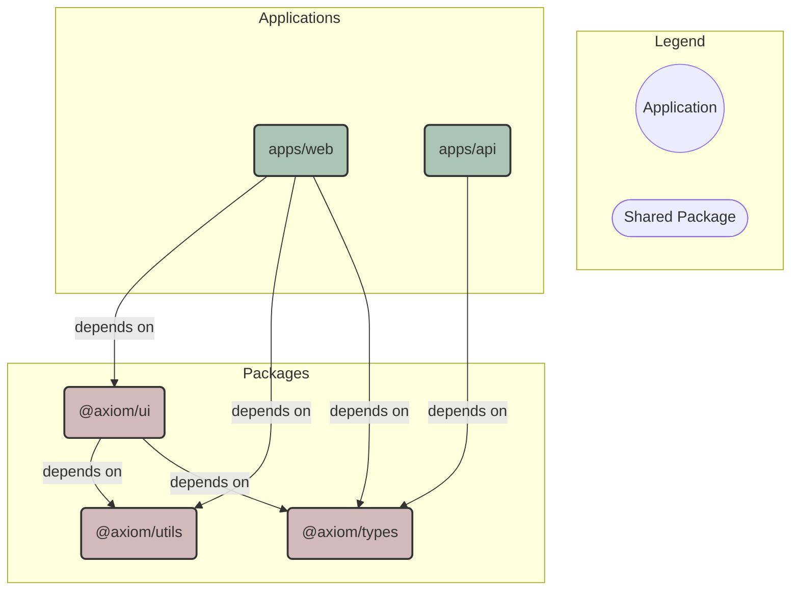

# Axiom

This is a project scaffold named **Axiom**, built on a **Monorepo** architecture based on **pnpm workspace**. It aims to provide a set of self-evident development axioms and best practices for quickly bootstrapping modern, scalable web applications. It integrates independent frontend apps, backend APIs, shareable UI components, utility libraries, and type definitions.

## ✨ Core Goals

- **Code Sharing & Reuse**: Share UI components, utility functions, and type definitions across different applications via the `packages` directory.
- **Development Efficiency**: Leverage Vite for fast development servers and build processes.
- **Code Quality**: Integrate ESLint, Prettier, TypeScript, and automated Git hooks to ensure consistent code style and type safety.
- **Structure & Maintainability**: A clear directory structure and modular design facilitate team collaboration and long-term maintenance.

## 🛠️ Tech Stack

| Category           | Technology                           | Purpose                                                   |
| :----------------- | :----------------------------------- | :-------------------------------------------------------- |
| **Main Framework** | React 18                             | Core library for building user interfaces.                |
| **Build Tool**     | Vite                                 | Provides an extremely fast dev server and optimized production builds. |
| **Language**       | TypeScript                           | Provides static type checking for the project, improving code robustness. |
| **Styling**        | Tailwind CSS                         | A Utility-First CSS framework for rapid UI design.        |
| **Package Manager**| pnpm                                 | A high-performance package manager with workspace support for monorepos. |
| **Testing**        | Vitest, React Testing Library        | For unit tests and component tests to ensure code quality. |
| **Code Standards** | ESLint, Prettier                     | Enforces code style and syntax conventions.               |
| **Commit Standards**| Commitlint, cz-conventional-changelog | Ensures consistency and readability of Git commit messages. |
| **Git Hooks**      | Husky                                | Automatically executes scripts on Git events (e.g., commit, push). |

## 📂 Project Structure

```
.
├── apps/
│   ├── api/             # Backend API application (Node.js)
│   └── web/             # Frontend web application (React)
├── packages/
│   ├── types/           # Shared TypeScript type definitions
│   ├── ui/              # Reusable UI components
│   └── utils/           # Common utility functions
├── .husky/              # Git hooks configuration
├── scripts/             # Automation scripts
├── .commitlintrc.js     # Commitlint configuration
├── eslint.config.js     # ESLint configuration
├── prettier.config.js   # Prettier configuration
├── tailwind.config.js   # Root Tailwind CSS configuration
└── tsconfig.json        # Root TypeScript configuration
```

## 🏗️ Architecture & Dependencies

This project follows a Monorepo architecture, integrating frontend and backend applications (`apps`) and shared code (`packages`) within a single repository.

### Dependency Graph


```mermaid
graph TD
    subgraph legend [Legend]
        direction LR
        app((Application))
        pkg([Shared Package])
    end

    subgraph Applications
        direction LR
        A1("apps/web"):::app
        A2("apps/api"):::app
    end

    subgraph Packages
        direction LR
        P1("@axiom/ui"):::pkg
        P2("@axiom/utils"):::pkg
        P3("@axiom/types"):::pkg
    end

    A1 -- "depends on" --> P1
    A1 -- "depends on" --> P2
    A1 -- "depends on" --> P3

    A2 -- "depends on" --> P3

    P1 -- "depends on" --> P2
    P1 -- "depends on" --> P3

    %% Define node styles: use low-saturation muted colors with #333 text for contrast
    classDef app fill:#a9c4b3,stroke:#333,stroke-width:2px,color:#333;
    classDef pkg fill:#d3baba,stroke:#333,stroke-width:2px,color:#333;
```

- **`apps/web`**: Frontend application, depends on `ui` (components), `utils` (utilities), and `types` (type definitions).
- **`apps/api`**: Backend API, depends on `types` (type definitions) to ensure data structure consistency with the frontend.
- **`packages/ui`**: Shared component library, depends on `utils` and `types`.
- **`packages/utils`** and **`packages/types`**: Foundational packages with no internal dependencies.

## 🚀 Getting Started

### Prerequisites

- [Node.js](https://nodejs.org/) (LTS version recommended)
- [pnpm](https://pnpm.io/installation)

### Installation

1. **Clone the repository:**

    ```bash
    git clone <your-repository-url>
    cd axiom
    ```

2. **Install dependencies:**
    ```bash
    pnpm install
    ```

### Development

Start both the frontend and backend dev servers simultaneously:

```bash
pnpm dev
```

- The frontend (`web`) will run at `http://localhost:5173`.
- The backend (`api`) will run at `http://localhost:3000`.

## 📜 Available Scripts

| Command           | Description                                     |
| :---------------- | :---------------------------------------------- |
| `pnpm dev`        | Start dev servers for all `apps`.               |
| `pnpm build`      | Build all packages and apps for production.     |
| `pnpm test`       | Run all tests.                                  |
| `pnpm test:watch` | Run tests in watch mode.                        |
| `pnpm lint`       | Check code style across the entire project.     |
| `pnpm format`     | Auto-format all files.                          |
| `pnpm type-check` | Run TypeScript type checking.                   |
| `pnpm clean`      | Clean all `dist` directories.                   |
| `pnpm commit`     | Use Commitizen to interactively generate commit messages. |

## 🤝 Contributing

All forms of contribution are welcome! If you'd like to contribute to the Axiom project, please follow these steps:

### Development Workflow

1. **Fork** this repository to your own GitHub account.
2. Create a new feature branch from the `develop` branch. Follow these naming conventions:
    - New feature: `feat/a-brief-description` (e.g., `feat/user-password-reset`)
    - Bug fix: `fix/a-brief-description` (e.g., `fix/login-form-validation`)
3. Make your code changes.
4. Before committing, ensure all quality checks pass:
    - Run tests: `pnpm test`
    - Check code style: `pnpm lint`
5. **Commit your changes**. This project strictly follows Conventional Commits. We strongly recommend using the `pnpm commit` command, which guides you through generating a compliant commit message.
6. Push your feature branch to your forked repository.
7. Create a Pull Request targeting the `develop` branch of the original repository. Provide a detailed description of your changes in the PR.

## 🔮 Future Enhancements

- **Component Library Docs**: Add Storybook or similar tooling to `packages/ui` for component documentation and interactive showcases.
- **State Management**: Depending on application complexity, consider introducing Zustand, Redux Toolkit, or other state management solutions.
- **CI/CD**: Set up automated continuous integration and deployment pipelines (e.g., using GitHub Actions) to automatically run tests, builds, and deployments on code pushes to the main branch.

## 📚 Project Documentation

Core project documentation is stored in the `docs/` directory:

- **Product Requirements Document (PRD)**: Defines the project's vision, goals, and feature requirements.
- **Architecture Decision Records (ADRs)**: Records important technical choices and their rationale.
- **Development TODO List**: Tracks project progress and future plans.
