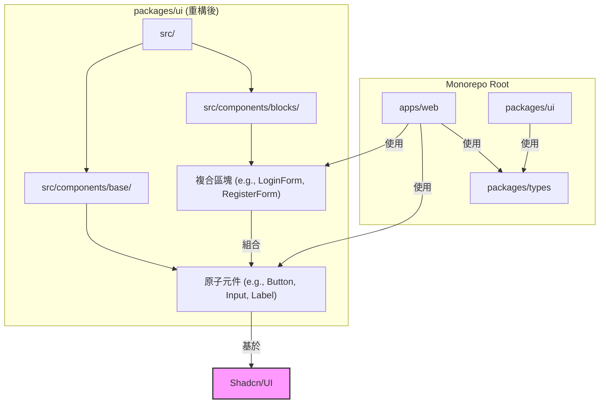

# 0001. 採用 Shadcn/UI 及分層元件架構

- **狀態 (Status)**: 已接受
- **日期 (Date)**: 2025-07-07

## 背景 (Context)

專案需要一個能夠快速開發、視覺風格統一且易於長期維護的 UI 系統。我們希望結合「WordPress 區塊編輯器」的模組化思想和現代 UI 框架的優點，避免從零開始打造所有元件，同時又保有完全的客製化能力。

## 決策 (Decision)

我們決定採用 **Shadcn/UI** 作為 UI 系統的基礎。它並非傳統的元件庫，而是一組基於 Radix UI 和 Tailwind CSS 的高品質、可複製到專案中的元件原始碼。

基於此，我們在 `packages/ui` 中設計了一個兩層的元件架構：

1.  **基礎元件 (Base Components)**: 位於 `packages/ui/src/components/base`，提供最基礎、原子化的 UI 單位，主要來自或改寫自 Shadcn/UI。例如：`Button`, `Card`, `Input`。
2.  **複合區塊 (Composite Blocks)**: 位於 `packages/ui/src/components/blocks`，由多個「基礎元件」組合而成，形成有特定業務功能的 UI 區塊。例如：`LoginForm`。

## 後果 (Consequences)

- **正面影響**:
  - **開發速度**: 開發者可以直接取用複合區塊，而無需從頭組合。
  - **一致性**: 所有區塊都基於同一套基礎元件，確保了視覺和體驗的一致性。
  - **可維護性**: 當需要修改品牌風格時（例如改變所有按鈕的圓角），只需修改 `Button` 基礎元件，所有使用到它的區塊都會自動更新。
  - **完全控制**: 因為元件程式碼直接在我們的專案中，我們可以隨意修改它，而不受限於第三方套件的更新。

- **負面影響**:
  - 需要手動管理元件的更新，無法像傳統套件一樣透過 `pnpm update` 自動升級。

- **取捨 (Trade-offs)**: 我們用「手動維護元件」換取了「最高的客製化自由度與專案獨立性」。
