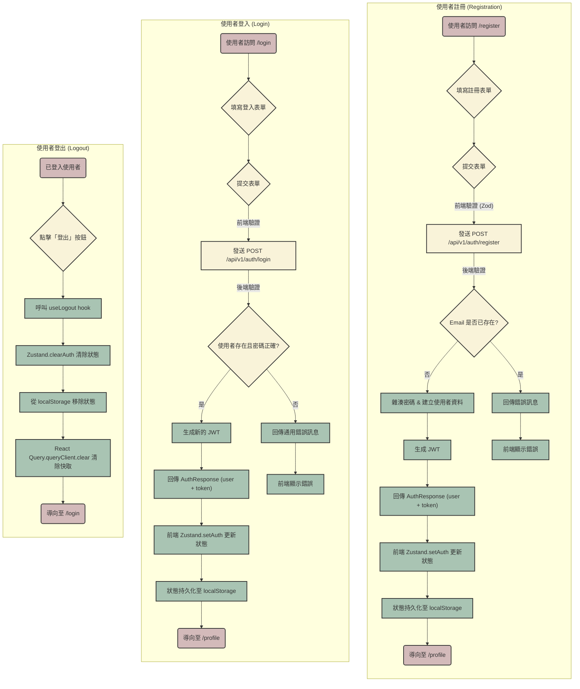
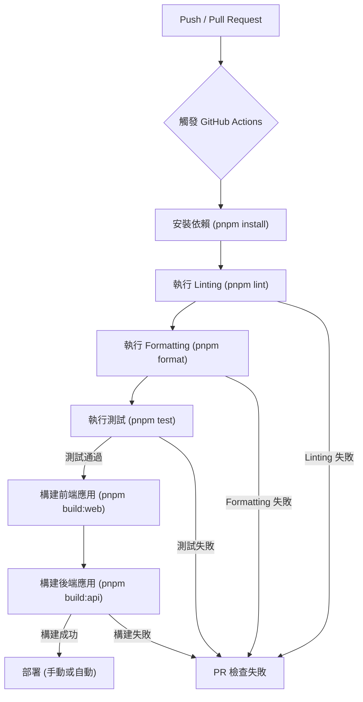

# Axiom 專案 - 產品需求文件 (PRD)

**版本:** 1.0
**日期:** 2023-10-27

## 1. 產品願景 (Product Vision)

**打造一個「不證自明」的現代網頁開發基礎設施。**

Axiom 旨在成為開發者啟動新專案時的首選骨架，讓他們可以跳過繁瑣的環境設定和架構決策，直接專注於實現業務價值。它本身就是一套經過驗證的最佳實踐，為高品質、可擴展的應用程式提供堅實的基礎。

## 2. 核心目標與解決的問題 (Core Goals & Problem Statement)

- **問題**: 從零開始建立一個現代網頁專案，需要耗費大量時間在技術選型、環境配置、程式碼規範設定、前後端架構搭建等重複性工作上，延緩了核心功能的開發。
- **目標**:
  1.  **加速啟動 (Accelerate Kick-off)**: 提供一個開箱即用的 Monorepo 環境，讓開發者在數分鐘內即可開始撰寫業務程式碼。
  2.  **確保品質 (Ensure Quality)**: 內建業界標準的程式碼規範、測試框架和 Git 工作流，從第一行程式碼開始就保證專案的健康度。
  3.  **促進協作 (Promote Collaboration)**: 透過清晰的架構和共享模組，降低團隊成員的溝通成本，提升長期可維護性。
  4.  **提供典範 (Provide a Paradigm)**: 內含一個完整的「使用者認證」功能範例，作為開發其他功能的參考和起點。

## 3. 目標使用者 (Target Audience)

- **主要使用者**:
  - **中小型團隊的開發者**: 需要快速啟動新專案，並希望團隊遵循統一的開發標準。
  - **獨立開發者/自由工作者**: 希望利用最佳實踐來提高個人專案的品質和開發效率。
- **次要使用者**:
  - **技術主管/架構師**: 尋求一個標準化的內部專案範本，以統一團隊的技術棧和開發流程。

## 4. 使用者故事 (User Stories)

### 4.1. 針對開發者

- **作為一名開發者**，我希望能一鍵安裝並執行一個包含前後端、共享元件和型別的完整專案，以便我能立即開始開發新功能。
- **作為一名開發者**，我希望能有一個清晰的目錄結構和依賴關係圖，以便我能快速理解專案的組織方式。
- **作為一名開發者**，我希望專案內建 ESLint, Prettier 和 Git 鉤子，以便我提交的程式碼能自動保持風格一致和高品質。

### 4.2. 針對範例應用的使用者

- **作為一名新訪客**，我希望能快速地使用我的名稱、電子郵件和密碼建立一個新帳戶，以便開始使用應用程式的完整功能。
- **作為一名現有使用者**，我希望能透過我的電子郵件和密碼安全地登入我的帳戶，以便存取我的個人資料和相關功能。
- **作為一名已登入的使用者**，我希望能清楚地看到我的登入狀態（例如，在頁面上看到我的名字），並且可以輕鬆地登出帳戶。

### 4.3. 核心使用者流程圖 (Core User Flowchart)

## 5. 功能需求 (Functional Requirements)

##### 5.1. 核心架構：Monorepo

- **描述**: 專案必須採用 `pnpm workspace` 實現的 Monorepo 架構。
- **驗收標準**:
  - 根目錄包含 `apps` 和 `packages` 兩個核心目錄。
  - `apps` 目錄下包含至少一個前端應用 (`web`) 和一個後端應用 (`api`)。
  - `packages` 目錄下包含可共享的 `ui`, `utils`, `types` 套件。

##### 5.2. 開發者體驗 (Developer Experience)

- **描述**: 提供一套簡化開發流程的工具和腳本。
- **驗收標準**:
  - 提供 `pnpm dev` 指令，能一鍵並行啟動所有 `apps` 的開發伺服器。
  - 整合 Husky 和 lint-staged，在 `git commit` 時自動執行 Linting 和 Formatting。
  - 整合 Commitizen (`pnpm commit`)，引導使用者產生符合 Conventional Commits 規範的提交訊息。

##### 5.3. 範例功能：使用者認證

###### 5.3.1. 使用者註冊 (`/register`)

- **介面欄位**: `名稱 (Name)`, `電子郵件 (Email)`, `密碼 (Password)`, `確認密碼 (Confirm Password)`。
- **驗證**:
  - 所有欄位皆為必填。
  - 電子郵件必須符合標準格式。
  - 「密碼」與「確認密碼」的內容必須完全一致。
  - 前後端使用 `@axiom/types` 中的 `RegisterFormSchema` 共享同一份 Zod 驗證邏輯。
- **後端處理**:
  - 收到 `POST /api/v1/auth/register` 請求。
  - 檢查電子郵件是否已被註冊。
  - 使用 `bcrypt` 對密碼進行雜湊處理。
  - 成功後，生成 JWT 並連同使用者資訊回傳。
- **成功後行為**: 自動導向至個人資料頁 (`/profile`)。
- **錯誤處理**: 在表單下方清晰地顯示來自後端的錯誤訊息。

###### 5.3.2. 使用者登入 (`/login`)

- **介面欄位**: `電子郵件 (Email)`, `密碼 (Password)`。
- **驗證**: 所有欄位皆為必填，使用 `@axiom/types` 中的 `LoginUserSchema`。
- **後端處理**:
  - 收到 `POST /api/v1/auth/login` 請求。
  - 查找使用者並使用 `bcrypt` 比對密碼。
  - 成功後，生成新的 JWT 並連同使用者資訊回傳。
- **成功後行為**: 自動導向至個人資料頁 (`/profile`)。
- **錯誤處理**: 為防止用戶枚舉攻擊，回傳通用的錯誤訊息，如「電子郵件或密碼不正確」。

###### 5.3.3. 身份驗證狀態管理

- **狀態持續性**: 使用者的登入狀態應在重新整理頁面後依然保持。
  - _技術實作: Zustand store 整合 `persist` middleware，將認證資訊儲存在 `localStorage` 中。_
- **API 請求**: 所有對後端受保護資源的請求，都必須在 HTTP Header 的 `Authorization` 欄位中攜帶 `Bearer <JWT>`。

###### 5.3.4. 路由保護 (Protected Routes)

- `/profile` 等頁面，只有在使用者登入後才能存取。
- 未登入的使用者嘗試存取時，應被自動重新導向至 `/login` 頁面。

###### 5.3.5. 登出

- 在應用程式的顯著位置提供「登出」按鈕。
- 點擊後，前端應清除所有認證資訊，並將使用者導向至登入頁。

## 6. 非功能性需求 (Non-Functional Requirements)

- **可維護性**: 所有程式碼必須使用 TypeScript，並遵循 `gemini.md` 中定義的開發準則。
- **安全性**:
  - 密碼儲存必須使用 bcrypt 雜湊，絕不以明文形式儲存或傳輸。
  - 身份驗證使用 JWT，並設定合理的過期時間。
  - 生產環境中，所有通訊必須使用 HTTPS。
- **文件**: `README.md` 必須清晰，並使用 `docs/adr` 和 `docs/prd.md` 記錄專案決策與需求。
- **使用者體驗 (UX)**:
  - 介面應在所有主流裝置上保持響應式設計。
  - 錯誤訊息應清晰、易於理解。
  - 載入狀態應有明確的視覺回饋。

## 7. 未來範圍 / 暫不實作 (Out of Scope / Future Work)

以下功能在當前版本 (v1.0) 中不包含，但可作為未來迭代的方向：

- **進階認證功能**:
  - 第三方登入 (OAuth: Google, GitHub 等)
  - 「忘記密碼」及密碼重設流程
  - 註冊後進行電子郵件驗證
  - 兩步驟驗證 (2FA)
- **文件與測試**:
  - 元件庫文件 (Storybook)
  - E2E 測試 (Playwright/Cypress)
  - API 文件 (Swagger)
- **基礎設施**:
  - 基於角色的存取控制 (RBAC)
  - 完整的 CI/CD 工作流程

